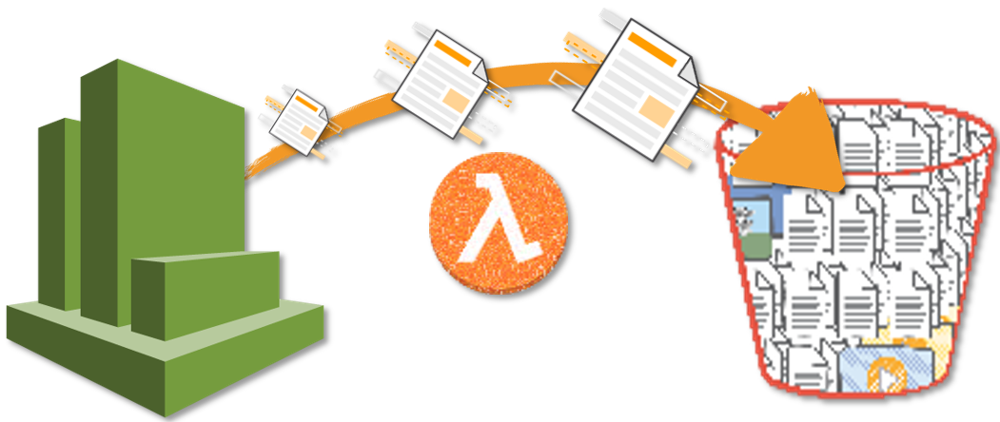

# Serverless Cloudwatch Logs To S3 Exporter

AWS Serverless Lambda function that sends log data from CloudWatch Logs and S3.



## Follow this article in [Youtube](https://www.youtube.com/watch?v=JS0bDErJ9Rw&list=PLxzKY3wu0_FKok5gI1v4g4S-g-PLaW9YD&index=31&t=0s)

1. ## Pre-Requisities

    We will need the following pre-requisites to successfully complete this activity,
    - `S3 Bucket` - Update the bucket with the policy mentioned below
    - IAM Role `serverless-cw-to-s3-exporter-role` - [Get Help for setting up IAM Role](https://www.youtube.com/watch?v=5g0Cuq-qKA0&list=PLxzKY3wu0_FLaF9Xzpyd9p4zRCikkD9lE&index=11)
        - _Managed Permissions_: `AWSLambdaExecute` - To allow Lambda to log events & Write to S3 Buckets
        - _Inline Policy_: `ListBucketPolicy` mentioned below
    - CloudWatch Log Group Name[s]

1. ### S3 Bucket Policy

    To receive CloudWatch Logs exports the following bucket policy should be applied.

    ```json
    {
        "Version": "2008-10-17",
        "Id": "Policy1335892530063",
        "Statement": [
            {
                "Effect": "Allow",
                "Principal": {
                    "Service": "logs.YOUR-REGION.amazonaws.com"
                },
                "Action": "s3:GetBucketAcl",
                "Resource": "arn:aws:s3:::YOUR-BUCKET-NAME"
            },
            {
                "Effect": "Allow",
                "Principal": {
                    "Service": "logs.YOUR-REGION.amazonaws.com"
                },
                "Action": "s3:PutObject",
                "Resource": "arn:aws:s3:::YOUR-BUCKET-NAME/*",
                "Condition": {
                    "StringEquals": {
                        "s3:x-amz-acl": "bucket-owner-full-control"
                    }
                }
            }
        ]
    }
    ```

1. ### Lambda IAM Policy

    Create a new IAM Policy `ListBucketPolicy` with the following  configuration. _If you want, restrict it only to the buckets of your interests, in resources section_.
    **A policy to allow the script to verify valid S3 buckets**

    ```json
    {
        "Version": "2012-10-17",
        "Statement": [
            {
                "Effect": "Allow",
                "Action": [
                    "s3:ListBucket",
                    "s3:HeadBucket"
                ],
                "Resource": "*"
            }
        ]
    }
    ```

1. ## ⚙️ Configure Lambda Function - `Serverless CloudWatch Logs To S3 Exporter`

    - Provide the function name & choose `Python 3.7`
    - Attach the IAM Role - `serverless-cw-to-s3-exporter-role`
    - [Get code here](https://www.youtube.com/c/valaxytechnologies/about)
    - `Save` the lambda function

1. ## ⚙️ Configure Lambda Triggers

    Goto the Cloudwatch Dashboard, We are going to use `Event Rules`
    - Choose `Create a new Rule`
    - Choose `Schedule` - [Get Help](#references)
    - For `Target`, Choose `Lambda Function`
       - _From dropdown select your Lambda Function Name_
    - In the bottom, `Configure Details`
    - Fill the `Rule Name` & `Rule Description`
       - _Make sure it is **Enabled**_
    - `Enable` Trigger by `Checking` the box
    - Click `Save`

    Now your lambda function should be triggered based on your schedule

1. ### 🔬 Testing the solution

    You can test it manually or set the cloudwatch events to trigger closest to the current UTC time

### Lamdba Runtime

Increase your lambda runtime as necessary depending about the amount of data to move. Perhaps run it inside _step functions_.

### Programming language

Python 3.x

## Known Limitations

This Lambda function has the following limitation:

- Currently If you want to export all log groups, you have to list them all manually. _This is by design, as the export tasks are limited to `1 PENDING` task at any time by AWS, and Lambda have limited time to push all the logs._

## 👋 Buy me a coffee

Buy me a coffee ☕ through [Paypal](https://paypal.me/valaxy), _or_ You can reach out to get more details through [here](https://youtube.com/c/valaxytechnologies/about).

### 📚 References

[1] - [AWS Docs - Export Log Data to Amazon S3](http://docs.aws.amazon.com/AmazonCloudWatch/latest/logs/S3ExportTasks.html)

[2] - [CloudWatch - Schedule Expressions for Rules](http://docs.aws.amazon.com/AmazonCloudWatch/latest/events/ScheduledEvents.html#RateExpressions)

### ℹ️ Metadata

**Level**: 200
